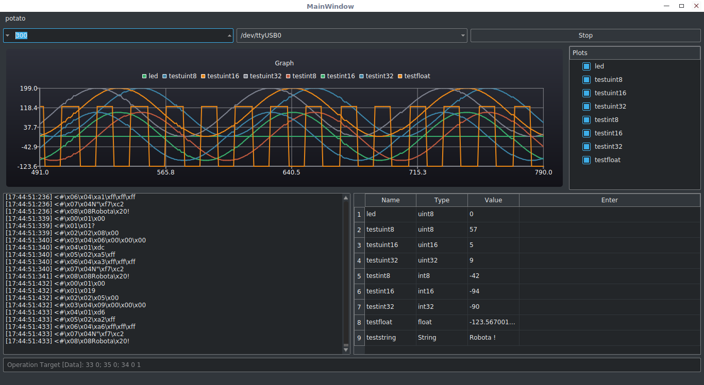

# Exposer-Gui (a Qt-based Gui for Exposer) [](https://travis-ci.org/robotadasufsc/Exposer-Gui)

### Description

Exposer-Gui is a Qt-based interface for the open-source project [Exposer].

### Media
Here is some images.

<div id="pattern" class="pattern">
  <ul class="g">
    <a href="https://raw.githubusercontent.com/patrickelectric/Exposer-Gui/readme/doc/images/window.png"></a>
  </ul>
</div>

### Dependencies
Exposer-Gui depends on the following projects:

* [Qt5.8] - Cross-platform application framework.
* [cmake] - Manage build process.

Here are the names of the packages needed for some distributions (subject to changes).

#### Arch Linux
```sh
$ sudo pacman -S qt5 cmake git
```
#### Debian/Ubuntu 17.04-
[download Qt5](https://wiki.qt.io/Install_Qt_5_on_Ubuntu) (Make sure you ticked
"QtCharts" on the installation);
```sh
$ sudo apt-get install cmake git
```

### Ubuntu 17.10+
```bash
$ apt-get update
$ apt-get install qt5-default qt5-doc git gcc g++ cmake libqt5charts5* libqt5serial*
```

### Installation

```
$ git clone https://github.com/patrickelectric/Exposer-Gui.git
$ cd Exposer-Gui
$ git submodule init
$ git submodule update
$ mkdir build && cd build
```
Run `cmake .. -DCMAKE_PREFIX_PATH=/opt/Qt5.7.0/5.7/gcc_64` in Debian/Ubuntu 17.04- or
`cmake ..` in Arch/Ubuntu 17.10+.
```
$ make
$ ./exposer-gui
```

### Internal documentation (need to be done)

Provided that you have doxygen installed, you may generate the documentation by
running the following command:

```
$ make doc
```

The documentation will then be available under multiple formats in /doc/.

## Contributing

1. Fork it.
2. Create a branch (`git checkout -b my_markup`)
3. Commit your changes (`git commit -ams "Added something very cool"`)
4. Push to the branch (`git push origin my_markup`)
5. Open a [Pull Request]
6. Enjoy a good book and wait :book:

[Exposer]: https://github.com/robotadasufsc/Exposer
[Qt5.8]: https://www.qt.io/
[cmake]: http://www.cmake.org/
[Doxygen]: http://www.stack.nl/~dimitri/doxygen/

[Pull Request]: https://github.com/patrickelectric/Exposer-Gui/pulls
